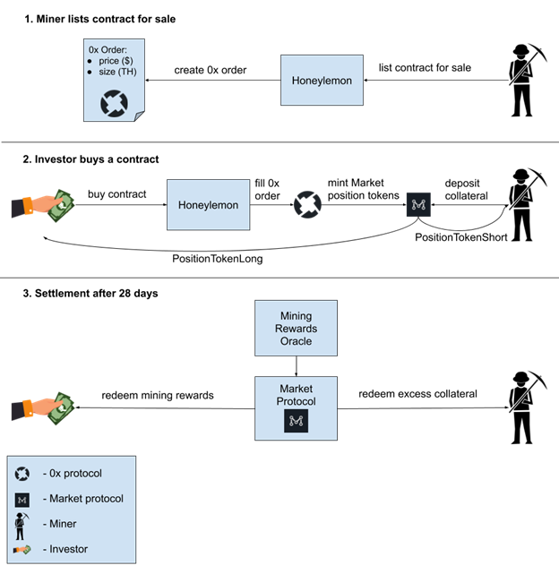
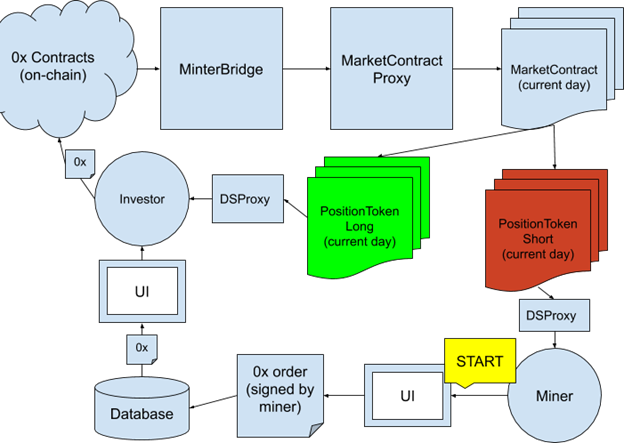

**Open request for comments. Please refer to [Issues](https://github.com/carboclan/pm/issues) for most updated discussions, and post your questions and comments as an Issue. You may follow the best practice set by reviewer @anthonyleezhang in this brilliant thread of dicussion on Issue #39 [Thoughts on MARKET vs UMA protocols](https://github.com/carboclan/pm/issues/39) .**

# Honeylemon Alpha Technical Design
repo: https://github.com/carboclan/dapp.honeylemon.market

## High-level flow

There are 3 main roles in the protocol: the Honeylemon admin, Miner and Investor. Below are scenarios that each of them perform.

### Honeylemon Admin
* Everyday we deploy a new MarketContract, PositionTokenShort and PositionTokenLong. We register the latest MarketContract in MarketContractProxy in order to make it easier to interact with the latest deployed MarketContract.
* In addition MarketContractProxy should implement a `balanceOf` method that will return the balance of the current-day PositionTokenLong (it can get its address from the current MarketContract). This is required in order to trick 0x protocol into believing that we transferred a token to the buyer (it has an assertion in the code).
* Honeylemon adminteam maintains an Oracle that posts daily BTC payoffs per 1Th on-chain. This data is used by the modified Market protocol contracts to calculate payoffs at settlement. The oracle provides several indexes for various purposes:
* Current hashrate index - used to calculate collateral requirements at contract start (this value doesn’t need to be onchain, it is used only when deploying daily Market contracts.
* Last 28 days payoff index - used to calculate payoffs at contract settlement

### Miner
1. Miner goes to the UI
2. Miner enters the sale price and amount of TH they want to sell. The UI shows required imBTC collateral and whether there’s enough in the wallet (otherwise order can’t be created)
3. Gives approval to draw the collateral token (imBTC) from their wallet. MetaMask popup with ETH transaction - once per address, 0x should provide js libs to simplify this.
4. The UI constructs a 0x order, opens MetaMask to sign it (no transaction, just signature) 
5. Order is sent to the server to be stored in a DB (0x relayer / mesh node)
6. The miner optionally can ask the server to remove/modify the order. I propose for the MVP only allow to delete an order and create a new one, not modify. We need to cancel order on-chain with 0x protocol.
7. Miners see their contracts with status: not filled, filled, partially filled, settled. The data for the list is read from chain checking all PositionTokens in the wallet as well as from the API using open 0x orders created by the current wallet.
8. After contract settlement miner can withdraw excess collateral from MarketCollateralPool contract by calling `MarketCollateralPool.settleAndClose`

### Investor
1. Investor goes to the UI, sees the best price based on all current orders
2. Investor enters TH amount they want to buy. The UI recalculates the final price (in case multiple orders are required to fill the size).
3. Gives approval to draw USDT token from their wallet. MetaMask popup with ETH transaction - once per address.
4. Investor submits Ethereum transaction to fill the order with 0x protocol
5. Once the tx is mined both miner and investor receive Market position tokens in their corresponding DSProxy contracts - the trade is on
6. After contract settlement investor can claim imBTC reward from MarketCollateralPool contract by calling `MakerCollateralPool.settleAndClose`

## 0x ERC20Bridge contract + Market protocol
### High-level order flow

0x v3 ERC20Bridge contract enables custom logic execution on order fill. That logic can mint Market protocol position tokens (see here) and distribute them to buyer and seller atomically within a single 0x ‘fillOrder’ transaction. Such orders are fully-compatible with the rest of 0x infrastructure and libraries.

### Smart Contracts
* [MarketContractProxy](https://github.com/carboclan/dapp.honeylemon.market/blob/master/contracts/honeylemon/MarketContractProxy.sol) - responsible for deploying, settlement and keeping the list of daily MarketContract and PositionToken instances. Proxies market protocol position token minting to the daily contract. Emits an event that our indexer captures to keep track of all entered contracts and their prices.
* [MinterBridge](https://github.com/carboclan/dapp.honeylemon.market/blob/master/contracts/honeylemon/MinterBridge.sol) - an implementation of 0x [ERC20Bridge](https://github.com/0xProject/0x-protocol-specification/blob/master/asset-proxy/erc20-bridge-proxy.md#writing-an-erc20bridge-contract) that enables custom logic execution on 0x order fill. Interacts with MarketContractProxy to mint position tokens.
* [DSProxy](https://github.com/carboclan/dapp.honeylemon.market/blob/master/contracts/honeylemon/DSProxy.sol) - an instance is deployed for each user to enable redemption of multiple position tokens at once. Position tokens are minted to DSProxy, this allows users to redeem multiple contracts in a single transaction, without having to give approval for each position token (this is particularly useful for miners who are likely to hold multiple contracts).

### Backend Components
* 0x API - used by the front-end to store signed 0x orders. Keeps track of order state and fillable amounts. Returns a sorted order book of fillable orders. Interacts with 0x Mesh instance to perform some of the functions. We use the API docker image as-is.
* 0x Mesh - is used by 0x API to keep track of order states and fillable amounts. We had to fork the code and modify the logic that calculates order fillable amount.
* Graph Protocol node - indexes on-chain events and provides a GraphQL API to query them. Is used by the front-end to get the list of current/expired contracts.
* Postgres DB - stores data for 0x API and the Graph Node.
* IPFS node - is used by the graph node.

See [docker-compose](https://github.com/carboclan/dapp.honeylemon.market/blob/master/docker/docker-compose-local.yml) for details.

### Market Making
Market protocol supports early contract redemption if an address owns both short and long position tokens for the same daily contract. This is useful for market makers to be able to net out their long/short exposure in the daily contract and unlock the collateral. The `redeemPositionTokens` transaction should be executed directly on the deployed instance of `MarketCollateralPool` contract. See implementation [here](https://github.com/MARKETProtocol/MARKETProtocol/blob/master/contracts/MarketCollateralPool.sol#L146).
