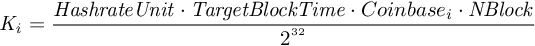
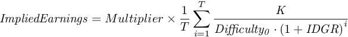
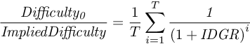

**Open request for comments. Please refer to [Issues](https://github.com/carboclan/pm/issues) for most updated discussions, and post your questions and comments as an Issue. You may follow the best practice set by reviewer @anthonyleezhang in this brilliant thread of dicussion on Issue #39 [Thoughts on MARKET vs UMA protocols](https://github.com/carboclan/pm/issues/39) .**

# Tokenized Synthetic PoW Mining Contract

## 1. Motivation

Crypto mining has become a sizable market. In 2018, a total of over US$ 9 billion worth of Proof-of-Work coins/tokens were distributed to miners as block rewards and transaction fees. Crypto mining often requires upfront capex investment to purchase hardware in order to receive certain amount of cryptocurrency as reward. There is significant risk involved in mining investment. Aside from operational risk in the construction and maintenance of mining and power facility, adverse weather condition and policy risks, there are two major risks associated with crypto mining: market price of cryptocurrencies and the fluctuation of network mining difficulties.

There are financial instruments readily available to hedge against the market price movements of cryptocurrencies, such as the CME Bitcoin futures. Our goal is to provide miners and other market participants instruments with exposure to the volatility of mining difficulties, enabling them to hedge against the underlying risks.

In Proof-of-Work mining, block rewards are specified by the protocol, and the total amount can be considered as fixed over a period of time. More miners joining the network will drive up the network hashrate, leading to a higher difficulty level of mining, which would in turn reduce the economic return of mining investment.

The current crypto mining market is inefficient. Absence of instruments to express forward-looking views without direct exposure, investors have only two choices: 1. Taking an illiquid long position via invest in mining hardware or mining operation; 2. Choose to sit out by not investing.

Miners sometimes resort to selling "cloud mining" contracts as an imperfect hedge against both difficulty and price movements. Typical cloud mining contracts require investors to pay to the issuer (cloud mining platform or a miner) in full upfront and receive a stream of cashflow over an indefinite period of time. It is a proxy for non-miners to gain indirect exposure to mining cashflow, while miners can offload some of the systematic risks. However, this instrument subjects investors to significant counterparty risks, and has been hotbed for scams.

Lack of effective instrument leaves miners unhedged in the wild swings in mining return. Miners tend to rush to market as coin price rises, driving up network difficulty which in turn results in less coins mined; as cryptocurrency prices fall, declining mining revenue may not cover the operational costs denominated in fiat, and the already illiquid mining assets becomes even harder to liquidate, leaving miners with little downside protection.

We hereby propose the Tokenized Synthetic PoW Mining Contract, which offers token holders synthetic exposure to mining payoff. Through trading this instrument, miners can hedge against difficulty, investors can be rewarded for bearing the risk. By filling in a market void via decoupling risks associated with network difficulty from that of market price of cryptocurrency, POW Mining Contract Tokens enable a more efficient mining market, and unlock possibilities of creating more crypto-native financial products that serve the blockchain infrastructure.

## 2. Contract Specification

After analysis across DeFi stack, and considering the various stages of development of existing derivatives protocols, the following contract is designed based upon [Market Protocol](https://marketprotocol.io).

###  2.1 Synthetic BTC Mining Contract
#### 2.1.1 Index

##### Design Considerations
- The index MUST has a clear physical meaning.
- The index SHOULD be relative to the mining difficulty only, which makes the index easy to predict.
- The index SHOULD make the contract easy for miners(hedgers) to trade. Thus, the miners could hedge the mining risk of a period of time by entering a position of this contract.
- The index SHOULD be comparable with some well-known number, such as the numbers in btc.com

##### Naming
The index names "Mining Revenue Index N days", short for _MRI{N}_, for example MRI28 and so on. We will publish the 1-day Mining Revenue Index daily, and abbreviate it as MRI.

##### Meaning
The BTC Mining Revenue Index (_BMRI_) represents **average daily block reward plus fees with 1Th/s hashrate over the last N days**.

1Th/s = 1012 h/s (Hashes per second)

##### Formula
_BMRI_ is calculated as following:

Where:
- **_T_** represents the number of difficulty adjustments during N days. **Let T=N/14**
- **_Difficultyi_** represents the value of difficulty after the i-th last difficulty adjustment
- **_Ki_** is a scaling factor calculated as below:

Parameter | Value | Note
------| -----|-------
_HashrateUnit_  | 10 12 Hash/s  | 1T hash |
_TargetBlockTime_ | 600 s | Target block time for bitcoin is fixed at 10 minutes
_Coinbasei_  | 12.5 BTC per Block | The block reward at i-th last mining difficulty adjustment.  Block reward halves every 21,000 blocks.
_NBlock_ | 144 | Number of blocks per day
**_Ki_**| **251457095** | havles as _Coinbasei_ halves

##### Notes
- As the difficulty adjusts every 2016 blocks, which is roughly 14 days, the N of the index is set to be a multiple of 14. 
- The index is changed whenever the difficulty adjusts before next block reward halves.
- The index is comparable with the "mining earnings" of btc.com. Especially, BME14 should be the same with the "mining earnings" of btc.com

##### Examples
Height  | Time                | Difficulty        | BME14     | BME28     | BME84
--------| --------------------|-------------------|-----------|-----------|--------
572,544 | 2019-04-21 09:54:28 | 6,353,030,562,983 | 3.958E-05 |           |  
574,560 | 2019-05-04 16:32:13 | 6,702,169,884,349 | 3.752E-05 | 3.855E-05 |  
576,576 | 2019-05-18 16:31:36 | 6,704,632,680,587 | 3.750E-05 | 3.751E-05 |  
578,592 | 2019-05-31 06:43:04 | 7,459,680,720,542 | 3.371E-05 | 3.561E-05 |  
580,608 | 2019-06-14 09:03:50 | 7,409,399,249,090 | 3.394E-05 | 3.382E-05 |  
582,624 | 2019-06-27 10:59:30 | 7,934,713,219,630 | 3.169E-05 | 3.281E-05 | 3.566E-05
584,640 | 2019-07-09 17:17:48 | 9,064,159,826,491 | 2.774E-05 | 2.972E-05 | 3.368E-05

More [BME Data](https://github.com/carboclan/pm/blob/master/research/BME.md)

#### 2.1.2 Index Cap & Floor

According to Market Protocol's design, each Synthetic BTC Mining Contract will specify its valid range, _Cap_ represents the upper bound, and _Floor_ represents the lower bound. Index reaching the upper or lower bound prior to expiration will trigger contract settlement.

Two principles to consider when setting the index range:
  - In order to reduce the demand for margin and increase leverage, a smaller index range is preferred.
  - On the other hand, a relatively safe (wide) index range will be set to prevent the early settelment triggered if the index reaches the bounds early.

#### 2.1.3 Contract Size

The value of one contract = Multiplier * The index value

Multiplier = 106 WBTC

#### 2.1.4 Expiration

Each Synthetic BTC Mining Contract will specify an expiration date. The contract expires at 02:00:00 (UTC) on the expiration date. In order to avoid the impact of block time volatility, the expiration time is usually choosen to be 7 days after the estimated time of a difficulty adjustment. According to the requirement of Market Protocol, the expired contract can be settled one day after expiration.

#### 2.1.5 Settlement

At settlement, Market Protocol smart contract will send WBTC to addresses that hold contract position tokens. Long token holder will receive ( _BME_ - _Floor_ ) * _Multiplier_ in WBTC per Contract, short token holder will receive ( _Cap_ - _BME_ ) * _Multiplier_ in WBTC per Contract.

#### 2.1.6 Margin

Issuer of the Tokenized Synthetic BTC Mining Contract needs to send ( _Cap_ - _Floor_ ) * _Multiplier_ amount in WBTC to the Market Protocol smart contract as collateral in order to mint contract position tokens. Contract positions are fully collateralized with no need to top up margins prior to settlement.

#### 2.1.7 Naming Convention for Contract Position Tokens

\<L|S\>BME\<N\>-\<Floor\>-\<Cap\>-\<YYMMDD\>

- L: long position
- S: short position
- N: N days of the index
- Floor: index lower bound, in the unit of 1E-7
- Cap: index upper bound, in the unit of 1E-7
- YYMMDD: Date of exiration

Example: SBME84-250-300-190718 token corresponds to a short position on a Synthetic BTC Mining Contract with BME84 Index valid range of [2.50E-5, 3.00E-5], expires on 02:00:00(UTC) at 2019/07/18.

## 3. Smart Contract Stack

Synthetic PoW Mining Contract token issuance, trading, on-chain collateralization, and settlement are executed via smart contracts enforced by ethereum blockchain consensus. Trust is minimized in the process, which lowers the entry barrier for trading and improves liquidity.

### 3.1 Tokenization Layer

Issuers can easily issue Synthetic PoW Mining Contract by minting position tokens via [Market Protocol](https://marketprotocol.io) and traders can easily build up long or short positions by buying these position tokens, which are standard ERC20s that can be stored off-exchange in user wallets and are tradeable on both centralized and decentralized exchanges.

Contract issuers mint sets of long and short position tokens pairs by sending collateral to Market Protocol smart contracts according to contract specifications. Once minted, contract issuers is market neutral by holding both long and short position tokens. For each contract, the outstanding long position tokens will be equal to short position tokens, as in pairs. Issuer wishing to enter into long position can sell its short position tokens, and vice versa.

Traders can buy position tokens to gain long or short exposure without becoming an issuer. Holders of position tokens can close the position and take profit any time by selling the tokens in the market without having to wait till settlement at contract expiration.

The contract specifications pre-define the cap and floor of the Index, and issuer pays full collateral according to the position ranges, there will be no liquidation prior to expiration as long as the Index falls within the ranges. To provide effective hedges for actual mining, miners would prefer not to face arbitrary liquidation prior to expiration. Position ranges in contract specifications must be defined wide enough to cover volatility in difficulty. 

Although contracts are fully collateralized upon issuance, the position range specification provides implicit leverage. When Index fluctuates, the rate of change in contract positions often will exceed that of the Index. The amount of leverage depends on the width of the position ranges relative to the Index, and the price of the position relative to the price range.

Example 1. The BME84 Index is at 5.52E-5 now, Carboclan Community specifies a new Synthetic BTC Mining Contract will expire in 84 days later. The contract specifications are as follow: 
  - Cap: 6.00E-5
  - Floor: 4.50E-5
  - Expiration: 2019-05-11 02:00:00 UTC

Alice would like to mint 1.0 units of contract position token pair. She sends (6E-5 - 4.5E-5) * 1E6 * 1.0 = 15WBTC to the Market smart contract as collateral, and minted 1.0 long position token and 1.0 short position token. A long token is worth (5.52E-5 - 4.50E-5) * 1e6 = 10.2 WBTC, a short token is worth (6.00E-5 - 5.52E-5) * 1e6 = 4.8 WBTC.

Later on, the Index falls to 5.50E-5, a long token is worth (5.50E-5 - 4.50E-5) * 1E6 = 10 WBTC, a short token is worth (6.00E-5 - 5.50E-5) * 1E6 = 5 WBTC. Alice would like to enter into a short position, so she lists her 1.0 long position in the market. Bob would like to enter into a long position, so he bought the 1.0 long position token, at a price of 9.8 WBTC. Bob paid to Alice 9.8 WBTC and received 1.0 long token.

While the actual price of the position token may be above or below the Index, in this example actual price of the long position token (9.8 WBTC) may be priced below the theoretical price (10 WBTC) calculated from the current Index, which may be caused by market expectation that the Index may drop further by expiration. On the other hand, while Index drops (5.52E-5 - 5.50E-5) / 5.52E-5 = 0.36%, but theoretical price for the long position token calculated from the Index drops (10.2 - 10) / 10.2 = 1.9%, which reflects 5.28 implicit leverage from the Index floor.

The contract expires on 2019-05-11 02:00:00 UTC and can be settled 1 day later. The Index is at 5.25E-5. Market Protocol smart contract pays Bob (5.25E-5 - 4.50E-5) * 1E6 * 1.0 = 7.5 WBTC, and (6.00E-5 - 5.25E-5) * 1E6 * 1.0 = 7.5 WBTC to short position token owner Alice. Alice's earnings: -15 + 9.8 + 7.5 = 2.3 WBTC, Bob's earnings: -9.8 + 7.5 = -2.3 WBTC.

### 3.2 Oracle
Market Protocol relies on oracle to provide the Index for settlement. Oracle is the only part in the entire system that is not completely decentralized.

Calculating BME requires off-chain data. Bitcoin mining difficulty data needs to be obtained from third party provider. The difficulty data is then processed by the oracle smart contract. The good news is that bitcoin mining difficulty only change every 14 days on average. Since the difficulty data is recorded on the bitcoin chain, all people can validate the authenticity of the data.

### 3.3 Trading Layer

Since the position tokens issued by Market Protocol are fully collateralized and fit ERC-20 standard, the position tokens can be traded on any centralized exchange (i.e. Binance and Bitstamp), and decentralized exchanges (i.e. 0x and Uniswap). Thus, tokenized Synthetic PoW Mining Contract is readily tradeable without having to develop new infrastructure or technology.

### 3.4 Variable Margin Layer

In 3.1 we’ve already analyzed the implicit leverage of the Market Protocol. However, when the Index fluctuates significantly, in order for the Index not to touch the cap or floor, the Index range needs to be set wider, which leads to a higher collateral ratio and lower leverage (capital utilization rate).

Short-term mining contracts (i.e 30 days) have less fluctuation. Therefore, the Index range is narrow and Market Protocol itself enables enough implicit leverage. However, long-term mining contracts (i.e 180 days) could fluctuate more than 100%, the fully collateralized method of Market Protocol will be capital inefficient.

Therefore, a variable margin layer could be introduced on top of the position token. The variable margin layer has such characteristic that a certain margin ratio is set according to the market price of the position. Margins only need to cover fluctuation in the short run and cannot cover the entire position. When the margin ratio drops due to market price change, margin calls can be issued to the party lacking margin to cover further market movement. On the other hand, if the margin ratio increases to more than necessary, the excess margin can be withdrawn from the margin account to realize the profit. Such a variable margin system lowers the margin requirement and increase capital efficiency.

A few DeFi protocols (i.e. dydx, bzx) can enable variable margin function. User can borrow token from dydx. Lender can deposit token A to the token pool of the smart contract. Borrower mortgages token B to create margin account and borrow token A from the token pool. The token A he borrowed is sold for token B. The token B he bought is again mortgaged into the margin account so that he can borrow more token A to be sold. The leveraged short on token A is now complete.

On the contrary, lender could deposit Token B to the token pool of the smart contract. Borrower mortgage Token A to create margin account and borrow Token B from the token pool. The Token B he borrowed is sold for Token A. Token A he bought is again mortgaged into the margin account so that he can borrow more Token B and exchange for Token A. A leveraged long postion on Token A is now complete.

Dydx supports a maximum leverage of 4x. When the price of the mortgaged token drops relative to the borrowed token, margin could drop to an insufficient amount. If the borrower cannot deposit enough collateral to meet the margin requirement in time, forced liquidation could occur. Variable margin is thus functional.

At the moment, dydx or bzx do not fully support position tokens from Market Protocol, more integration work still needs to be done.

## 4. Use Cases

Tokenized Synthetic PoW Mining Contract has multiple use cases.

### 4.1 Risk Exposure

Before purchasing mining rigs and start mining, investors need to estimate ROI. Purchasing mining rigs is a onetime investment. Electricity cost for mining is relatively stable as well. Therefore, investment for mining can be considered fixed over some period of time. The only factors affecting mining return is the price movement of the underlying coin(s) mined and their mining difficulties. Various financial product (futures, perpetual swaps and options) can be utilized to hedge against price fluctuation. Synthetic POW Mining Contract fills the market void by providing a financial instrument with exposure to risks associated with mining difficulty fluctuation. Investors could observe the market price for mining contract of various terms, reflecting market’s collective projection on mining earnings, similar to that of the term structure of interest rates or that of the volatility surface of options.

i.e On May 1st, 2019, BME14 Index is 3.95E-5. The following table indicates the market price for Tokenized Synthetic PoW Mining Contracts in various terms.

Contract position token |	Expiration date |	Market price	| Implied mining earnings
------------------------|-----------------|---------------|----- 
LBME28-300-500-190526 | 19-05-26 | 8 WBTC | 3.8E-5 BTC / 1T\*24H
SBME28-300-500-190526 | 19-05-26 | 12 WBTC | 3.8E-5 BTC / 1T\*24H
LBME84-200-400-190716 | 19-07-16 | 12 WBTC | 3.2E-5 BTC / 1T\*24H
SBME84-200-400-190716 | 19-07-16 | 8 WBTC | 3.2E-5 BTC / 1T\*24H

Long position token prices reflect market view on expected average daily mining earnings within 1T hash/s during N days before the contract expires. The implied mining earnings = the market price of the long position token / _Multiplier_ + the floor of the index.
The market believes that under same amount of hashrate, the mining earnings will gradually decrease. Investors could figure out that expected mining earnings gradually decreases, thereby estimating their own mining ROI more rationally.

### 4.2 Hedging

The synthetic POW mining contract can hedge mining risks in addition to revealing them. Similarly, we set aside the cryptocurrency price movement here, since there already exist derivatives for price hedges. Investors could enter a short position in said contract to hedge difficulty related risks when mining. When difficulty goes up, mining earnings goes down, the profit on the short position could negate the decrease in actual mining earnings. When difficulty goes down, mining earnings goes up, the loss on the short position could negate the increase in actual mining earnings. The hedging process thus locked in mining earnings. The earnings is (cap of the Index * _Multiplier_ - the price when entering the position).

For example, on May 1st, 2019, Alice purchased a batch of mining rigs that clocks 100T hash/s. She wanted to lock in mining earnings for the next 6 mining difficulty adjustment cycles (about 84 days, from 2019-5-4 to 2019-7-27). Therefore, Alice purchased 100 * 84 / 1E6 = 0.0084 short position tokens of SBME84-200-400-190716. The following table reflects her P&L.

Position Token       | Entry Price | Index when settled | P&L / Token  | Position P&L   | Mining income | Comprehensive income
---------------------|:-----------:|:------------------:|:------------:|:--------------:|:-------------:|:-------------------:
SBME84-200-400-190716| 8           |            3.36E-5 |   -1.6       |     -0.01344   |       0.28224 | 0.26880
SBME84-200-400-190716| 8           |            2.86E-5 |    3.4       |      0.02856   |       0.24024 | 0.26880

_\* Currency in above table is WBTC_

### 4.3 Fixed-income Investment

The Synthetic POW Mining Contract decouples risks from mining difficulty fluctuation and risks from underlying price movements, thereby enabling new financial instruments such as fixed income products. Investors can at the same time purchase or lease physical mining rigs and start mining, and entering short positions to hedge risks regarding difficulty. If the investor’s base currency is USD, then he could also enter a short position in futures to hedge away exchange rate risk. The above-mentioned portfolio could be structured into a fixed income product with streams of cashflows, which would allow for major capital injection into the mining space. Fixed-income investors are required to manage the mining farm and mining rigs so that the mining operation runs smoothly. Their role is pivotal in connecting the synthetic mining derivatives and physical mining operations.

### 4.4 Finance Leasing

The major pain point for miners has been the lack of capital for expansion. Due to the difficulty of hedging mining risk, there is little incentive for lenders to provide capital to miners. Miners now can lease mining capacity to risk-free fixed income investors on demand, or mortgage the rigs to lenders so that they can receive cashflow and expand. Capital provider could require the borrowers to enter short position in both mining contract and token exchange rate, thereby stabilize their projected cashflows and increase their ability to repay loans.

### 4.5 Cloud Mining

A synthetic cloud mining service can be easily built upon the mining contract. The synthetic cloud mining service targets users who already understand how cloud mining works.

Traditionally, investing in cloud mining has the following economic model: User invests a certain amount of money to purchase cloud mining capacity and receives mining earnings (netted of maintainence fees) daily in the period following the investment. The investor hopes that the total return would be greater than the initial investment. Disregarding token exchange rate fluctuation (or fully hedging exchange rate), cloud mining return only depends on mining difficulty.

Mining contract can easily realize the above process: User purchases an array of same-sized long positions of mining contract that settle in chronological order, with the lower bound of the Index being 0. This process is very similar to cloud mining. The user will receive settlement amount from the mining contract in chronological order. The process of receiving the earnings mimics mining cashflow. The amount of hashrate user purchased corresponds to the long position of the Index. For example, the bitcoin mining contract use 1T hash/s as the basic unit. Therefore, purchasing (1 / _Multiplier_) long position tokens is equivalent to purchasing 1T hash/s of cloud mining capacity. Since the lower bound of the Index is 0, long position will never be liquidated, which is similar to mining.

### 4.6 Speculation

Synthetic PoW Mining Contract forms a two-sided market. In this market, an investor could long or short PoW Mining Index. If the investor chooses to enter into a long position, then he/she effectively becomes the counterparty of the hedging miner, and should be rewarded for bearing mining difficulty risks.

### 4.7  Margin Funding

For longer-term mining contracts, the Index could fluctuate in a wider range. In order for the Index not to touch the boundaries, the boundaries need to be set to a wider range. Thus, more collateral is needed in the Market Protocol smart contract for both long and short tokens, and drives up both tokens’ price, in turn reducing capital efficiency. The market for hedging could also go down if both fixed investment for mining rigs and hedging require large amount of capital commitment. Therefore, we introduce variable margin via margin protocols such as dydx's.

Under variable margin, a new business model arises. Lenders can fund margin traders and gain risk free earnings. Investors or market makers create long/short token pairs via Market Protocol smart contract. They do not trade the tokens but maintain net position neutral. Margin funding lenders can lend both long and short tokens to the liquidity pool of financing platform like dydx. When margin traders borrow long or short token from dydx, margin funding lenders can gain risk-free interests.

### 4.8 Market Maker

Market maker exists in all two-sided markets. Market maker makes profit by providing liquidity and bear market making risks. Since position tokens are all standard ERC-20 tokens. All market making mechanisms in the crypto world could be recalibrated to be utilized in this market. Market makers can follow the traditional buy-low, sell-high strategy by observing the orderbook. They can also profit from creating position token pairs and lend it to automatic liquidity pool like Uniswap.

## 5. Pricing
Synthetic PoW Mining Contract is a new hashrate derivative, and the way to price it remains to be explored. Here are a few simple technical indicators. It is hoped that these indicators will help the counterparty to price the contract.

### 5.1 Implied Difficulty
The price of each contract implies an expected daily average mining earnings within 1T/s hashrate. Implied Earnings can be calculated by the following two formulas:

From the implied earnings, the corresponding implied difficulty can be calculated. The implied difficulty is calculated by the following formula:

Where _K_ is the _K_ used by the formula in 2.1.1.

Example: Referring to the example in 4.1, on May 1, 2019, the difficulty is 6.35T and the BMI14 index corresponding is 3.95E-5. The table below shows the implied difficulty and implied difficulty growth rate (IDGR, see 5.2). 

Position Token        | Market Price | Implied Earnings | Implied Difficulty |  IDGR
----------------------|--------------|------------------|--------------------|--------
LBME28-300-500-190526 | 8 WBTC       | 38 BTC / 1T\*24H | 6.62T              |  2.82%
SBME28-300-500-190526 | 12 WBTC      | 38 BTC / 1T\*24H | 6.62T              |  2.82%
LBME84-200-400-190716 | 12 WBTC      | 32 BTC / 1T\*24H | 7.86T              |  6.46%
SBME84-200-400-190716 | 8 WBTC       | 32 BTC / 1T\*24H | 7.86T              |  6.46%

Traders can predict the change of difficulty over time and give an predicted value of the implied difficulty, thus launching their corresponding bid.

### 5.2 Implied Difficulty Growth Rate
The calculation of the BME index refers to a set of continuous difficulty data. The market price of the contract also reflects the prediction of the change of difficulty. Implied Difficulty Growth Rate (IDGR) is the average growth rate of difficulty after each difficulty adjustment implied from the contract price. The relationship between implied difficulty growth rate and implied mining earnings has the following relationship:

Where,
  - _K_ and _T_ are the values used by the formula in 2.1.1
  - _Difficulty0_ is the difficulty after the T+1th last difficulty adjustment before the contract expires
 
Substituting the above formula into the implicit difficulty formula can give the relationship between the implied difficulty and the implied difficulty growth rate as:

 
When T is large, the analytical solution of the implied difficulty growth rate cannot be easily obtained from the implicit difficulty. At this time, the numerical solution can be obtained by Newton iteration method.

See the example in 5.1 for an example.

Traders can calculate the corresponding contract price by predicting a reasonable implied difficulty growth rate.

### 5.3 Decomposition pricing
Since the index of the contract is only related to the difficulty, by predicting the mining difficulties of the feture difficulty cycles one by one, the corresponding predicted settlement index can be derived to price the position token.

An example is used to illustrate this method. On May 20, 2019, LBME84-200-400-190716 is priced using a decomposition pricing method. Note that there are 6 difficulty adjustments in the contract period at this time, and 2 difficulty adjustments have been made before May 20th. We will price the contract by separately predicting another 4 difficulty adjustments. The table below gives several different forecast data and corresponding token prices:

Difficulty 1|Difficulty 2|Predicted Difficulty 3|Predicted Difficulty 4|Predicted Difficulty 5|Predicted Difficulty 6|Predicted Settlement Index|Price
----|-----|--------|---------|--------|--------|-----------|--------
6.7|6.7|6.9|7.1|7.3|7.9|3.55E-05|15.5
6.7|6.7|7.4|7.6|7.9|8.3|3.40E-05|14.0
6.7|6.7|6.5|6.4|6.3|6.2|3.89E-05|18.9

_The difficulty unit in the above table is T (1012)_

